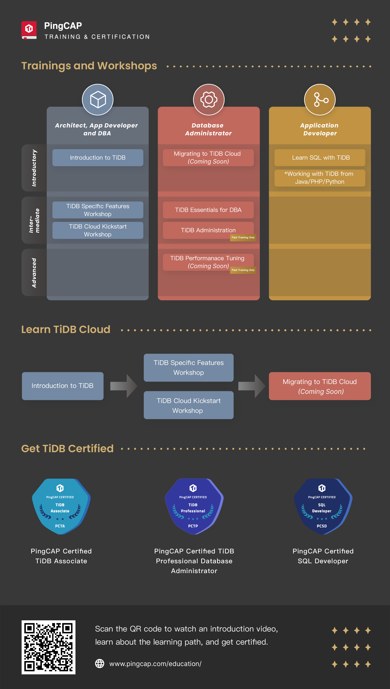

# Lab Assets for TiDB Training Courses
## Trainings and Workshops

+ Caution:
  + All scripts in this repo provide no production warrenty, use them at your own risks.
  + Please ask your instructor for the guidance about how to use the artifacts in this repository.

## Folders Description
+ All scripts are placed in `scripts/` folder.
+ All dependent assets support the scripts are placed in `scripts/misc/` folder.

## TiDB Trainings
+ [PingCAP Training & Certification](https://pingcap.com/education/)

## Additional Readings
+ [TiDB Documentation](https://docs.pingcap.com/)
+ [TiDB Developer Guide](https://docs.pingcap.com/tidb/stable/dev-guide-overview)
+ [TiDB Kits for Developers](https://github.com/pingcap/tidb-course-201-lab/blob/master/ninja-kits/)
