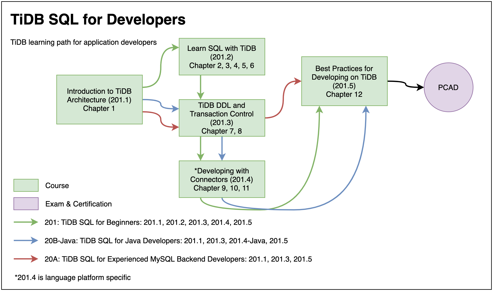

# TiDB SQL for Developers Course Lab v6.x (English README)
*"From entry level to mastery."*

+ Caution:
  + All scripts in this repo provide no production warrenty, use them at your own risks.
  + Please ask your instructor for the guidance about how to use the artifacts in this repository.

## Folders Description
+ Lab guides are placed in `lab-guide/guide/en/` folder.
+ All scripts used in this course are placed in `scripts/` folder.

### TiDB Trainings
+ [PingCAP Education](https://en.pingcap.com/education/)

----------------------------------------------------------------------------------------------

# TiDB SQL for Developers 课程实验 v6.x (Chinese README)
*"从入门级到精通最佳实践。"*

+ 注意:
  + 此仓库中所有的脚本均不提供生产环境的保证, 使用它们需要您自担风险。
  + 有关如何使用此仓库中的文件的详细问题, 请向课程培训讲师咨询。

## 目录说明
+ 实验指南在 `lab-guide/guide/zh/` 目录下
+ 课程中所有的脚本与示例代码被放置在 `scripts/` 目录下

### 面向应用开发者系列课程
+ [PingCAP Education 中文](https://pingcap.com/zh/courses-catalog/back-end-developer)

### 全部 TiDB 课程
+ [TiDB 全部中文课程](https://pingcap.com/zh/courses-catalog)
