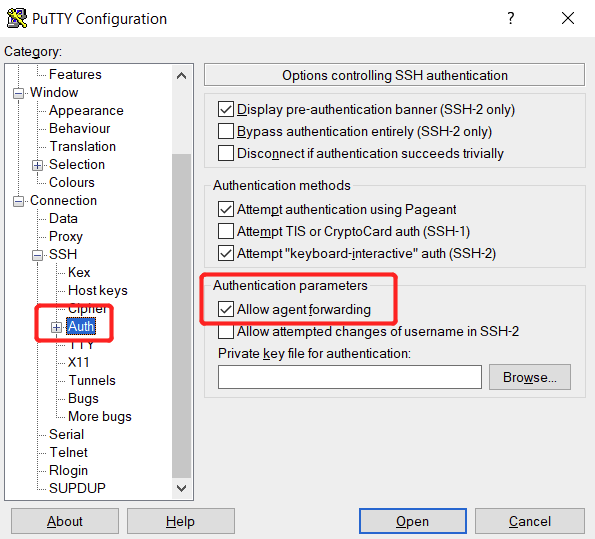

# Course TiDB Administration Class Setup Guide for Students [v6.1]

## Exercises Nodes Information
You will receive a table from your instructor that describes the exercise environment before each hands-on exercise. Such as the following, assume that you are assigned as `user2`:
      
    | Instance ID         | Public IP      | Private IP | Name    | Instructor | Student | Role     | Up Time (mins) |
    | :------------------ | :------------- | :--------- | :------ | :--------- | :------ | :------- | :------------- |
    | i-0e2735559552b7da1 | 54.200.217.xx  | 10.0.1.84  | db      | tony       | user2   | db1      | 40             |
    | i-0f7b09c9bc8fcd036 | 54.245.200.xxx | 10.0.1.34  | kv      | tony       | user2   | kv1      | 40             |
    | i-0719bce29f84ca0cf | 54.190.153.xxx | 10.0.1.102 | kv      | tony       | user2   | kv2      | 40             |
    | i-09060cc331b959d65 | 35.92.7.xx     | 10.0.1.161 | kv      | tony       | user2   | kv3      | 40             |
    | i-0a7296b8acdc42d93 | 34.220.83.xx   | 10.0.1.33  | pd      | tony       | user2   | pd1      | 40             |
    | i-077d4563188fd5387 | 35.90.45.xxx   | 10.0.1.123 | pd      | tony       | user2   | pd2      | 40             |
    | i-070e8ceabd90b4edf | 35.92.217.xxx  | 10.0.1.74  | pd      | tony       | user2   | pd3      | 40             |
    | i-0b24f21bffea8476f | 35.87.9.x      | 10.0.1.252 | tiflash | tony       | user2   | tiflash1 | 40             |

## Laptop Setup and SSH Login (Linux or macOS)
1. You will receive a private key file, `*.pem`, from your instructor, make sure the permission is set to `400`.
      ```
      $ mv <key_file> ~/.ssh/ 
      $ chmod 400 ~/.ssh/<key_file>
      ``` 

2. Connect to your EC2 instance, using the following commands with `SSH` forward enabled. The example is using the `pd1` node as the login target:
    ```
    $ ssh-add  ~/.ssh/<key_file>
    $ ssh -A ec2-user@34.220.83.xx
    ```

## Laptop Setup and SSH Login (Windows)
1. Install [PuTTY](https://www.putty.org/) on your computer.
   
   Download and install PuTTY from the [PuTTY](https://www.putty.org/) official page. If you already have an older version of PuTTY installed, we recommend that you download the latest version. Be sure to install the entire suite.

2. Convert the private key file (`*.pem`), from your instructor, to `*.ppk` format using [PuTTYgen](https://www.puttygen.com/). 

   You may follow the [guide]((https://docs.aws.amazon.com/AWSEC2/latest/UserGuide/putty.html)) by AWS in the section `Convert your private key using PuTTYgen`.

3. Configure the key-quartermaster.
   + Open `Pageant` from the start menu. (Note: it may run off to the system tray)
   + Click `Add Key` to include the key in `*.ppk` format.

4. Connect to EC2 Instance from Windows using PuTTy.

   Make sure that you also allow the agent SSH forwarding in PuTTY (See the image below. It might be slightly different from yours due to software versions).

   

## Scripts Introduction
1. After successfully logging in EC2 instance (you use `pd1` node as the Control Machine throughout the course), you will see the following prompt. The VM node you currenly logging in is the de facto `Control Machine`:
      ```
      Last login: Sat Jan 28 09:24:36 2023 from 120.204.xx.xx

          __|  __|_  )
          _|  (     /   Amazon Linux 2 AMI
         ___|\___|___|

      https://aws.amazon.com/amazon-linux-2/
      [ec2-user@ip-10-0-1-33 ~]$ 
      ```

2. Scripts for hands-on exercises are staged at your home directory, run `ls -lF` to verify the result:
      ```
      $ ls -lF
      total 108
      -rwxr-xr-x 1 ec2-user ec2-user 8470 Jan 29 10:26 00-prepare-node-roles-for-user.sh*
      -rwxr-xr-x 1 ec2-user ec2-user   98 Jan 29 10:26 01-install-tiup.sh*
      -rwxr-xr-x 1 ec2-user ec2-user  435 Jan 29 10:26 02-precheck-and-fix-nodes.sh*
      -rwxr-xr-x 1 ec2-user ec2-user  136 Jan 29 10:26 03-create-cluster.sh*
      -rwxr-xr-x 1 ec2-user ec2-user   54 Jan 29 10:26 check-cluster.sh*
      -rwxr-xr-x 1 ec2-user ec2-user   29 Jan 29 10:26 cloud-env.sh*
      -rwxr-xr-x 1 ec2-user ec2-user  129 Jan 29 10:26 connect-4000.sh*
      -rwxr-xr-x 1 ec2-user ec2-user  129 Jan 29 10:26 connect-4001.sh*
      -rwxr-xr-x 1 ec2-user ec2-user  114 Jan 29 10:26 destory-all.sh*
      -rw-r--r-- 1 ec2-user ec2-user 1784 Jan 29 10:31 eight-nodes-hybrid.yaml
      -rwxrwxr-x 1 ec2-user ec2-user  867 Jan 29 10:31 hosts-env.sh*
      -rwxrwxr-x 1 ec2-user ec2-user   18 Jan 29 10:31 ssh-to-cm.sh*
      -rwxrwxr-x 1 ec2-user ec2-user   18 Jan 29 10:31 ssh-to-db1.sh*
      -rwxrwxr-x 1 ec2-user ec2-user   18 Jan 29 10:31 ssh-to-db2.sh*
      -rwxrwxr-x 1 ec2-user ec2-user   17 Jan 29 10:31 ssh-to-kv1.sh*
      -rwxrwxr-x 1 ec2-user ec2-user   17 Jan 29 10:31 ssh-to-kv2.sh*
      -rwxrwxr-x 1 ec2-user ec2-user   18 Jan 29 10:31 ssh-to-kv3.sh*
      -rwxrwxr-x 1 ec2-user ec2-user   18 Jan 29 10:31 ssh-to-monitor.sh*
      -rwxrwxr-x 1 ec2-user ec2-user   18 Jan 29 10:31 ssh-to-pd1.sh*
      -rwxrwxr-x 1 ec2-user ec2-user   18 Jan 29 10:31 ssh-to-pd2.sh*
      -rwxrwxr-x 1 ec2-user ec2-user   18 Jan 29 10:31 ssh-to-pd3.sh*
      -rwxrwxr-x 1 ec2-user ec2-user   17 Jan 29 10:31 ssh-to-tiflash1.sh*
      drwxr-xr-x 3 ec2-user ec2-user  114 Jan 29 10:26 stage/
      -rwxr-xr-x 1 ec2-user ec2-user   52 Jan 29 10:26 start-cluster.sh*
      -rwxr-xr-x 1 ec2-user ec2-user   58 Jan 29 10:26 stop-cluster.sh*
      -rw-r--r-- 1 ec2-user ec2-user 1924 Jan 29 10:26 template-eight-nodes-hybrid.yaml
      ```

3. Follow the instructions on the lab guide to complete the execises. 

## (Optional) Step-by-Step Fast Forward Scripts
1.  Gather nodes information and setup the sample topology file.
    ```
    $ ./00-prepare-node-roles-for-user.sh <user_code> <trainer_name>
    $ source ./hosts-env.sh
    ```

2. Install `tiup` command line tool.
    ```
    $ ./01-install-tiup.sh
    $ source .bash_profile
    ```

3. Check system settings for cluster deployment prerequisites and enable automatic repair for the failed checks.
    ```
    $ ./02-precheck-and-fix-nodes.sh
    ```

4. Deploy a TiDB cluster. In execises, your cluster name is `tidb-test`.
    ```
    $ ./03-create-cluster.sh 
    ```

5. Start your cluser. In execises, your cluster name is `tidb-test`.
    ```
    $ ./start-cluster.sh
    ```
    
6. Check the status of your cluster. In execises, your cluster name is `tidb-test`.
    ```
    $ ./check-cluster.sh 
    ```
## (Optional) Exercise Fast Forward Scripts
1. Fast forward to complete the exercises 1:
    ```
    $ ./ff1.sh
    $ source ./hosts-env.sh
    $ source .bash_profile
    ```
