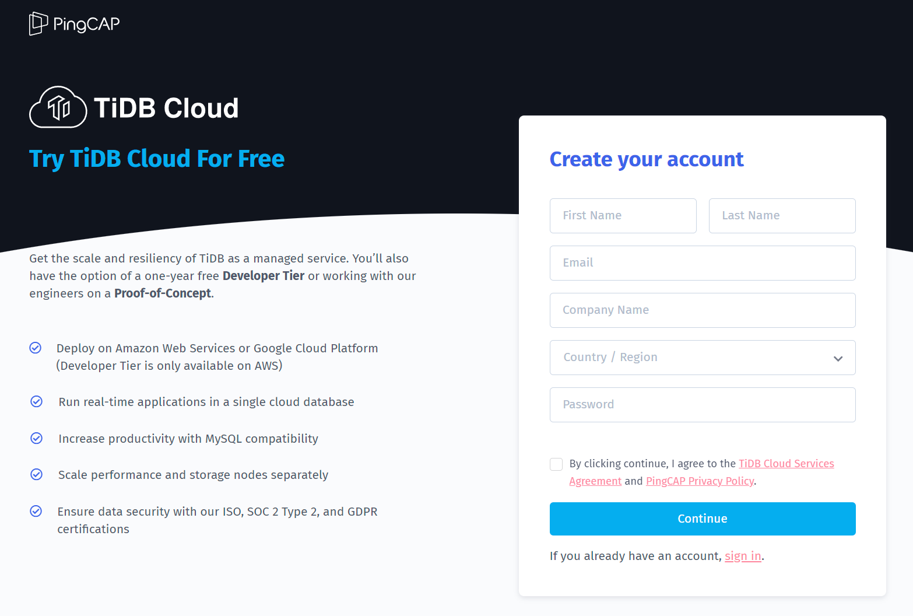
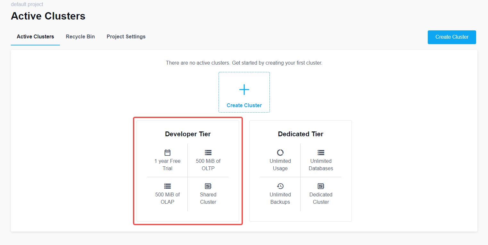
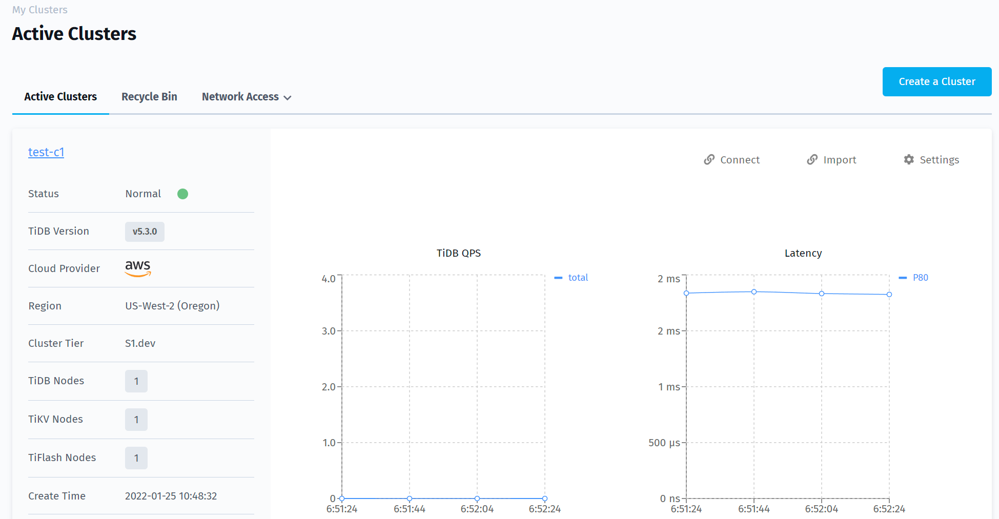
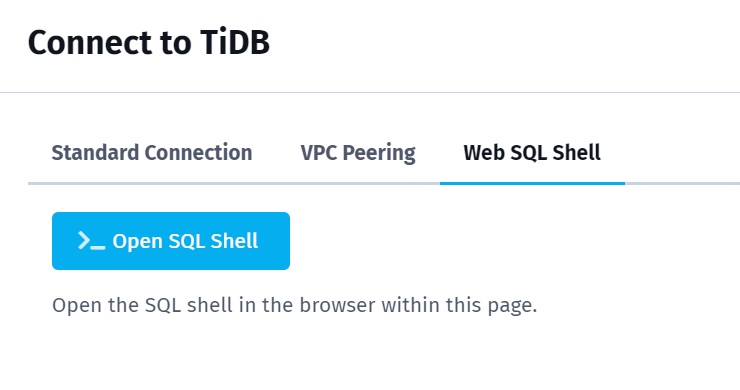

# Lab 201.1.1a: Subscribe to "TiDB Cloud Developer Tier" as the Lab Environment

## Objective
Deploy a free tier cluster in TiDB Cloud for the labs in this course.

## Prerequisites
+ Internet connection.
+ Database client installed:
  + Recommand: [MySQL client](https://google.com/search?q=MacOS+mysql+client+install)
  + Alternative: [MySQL Workbench (be noted, the version should be: 6.3.10, landing page might show the latest version instead)](https://downloads.mysql.com/archives/workbench/)

## Steps

------------------------------------------------------
#### 1. Sign up for TiDB Cloud: Open a browser and visit `https://tidbcloud.com`，click `Sign up` to complete registration and login.


------------------------------------------------------
#### 2. Select the Free Developer Tier: Click `Get Started for Free`


------------------------------------------------------
#### 3. Create a cluster: Name the Cluster, set a password, select a cloud provider, select a region, click `Submit` below, observe the creation steps, wait about 5-15 minutes until `Status` changes from `Creating` to `Normal`


------------------------------------------------------
#### 4. Click `Connect` on the right, select `Web SQL Shell`, then click `>_ Open SQL Shell`


------------------------------------------------------
#### 5. Enter the password set in step 3 to log in, view the database version, and keep the session


------------------------------------------------------
#### 6. Open a new session from the local terminal to access TiDB database in TiDB Cloud
+ Click `Connect` on the TiDB Cloud Cluster page
+ On the `Connect to TiDB` page, in the `Standard Connection`, click `Add Your Current IP Address`
+ Copy the command listed under `Step 2: Connect with a SQL client` and execute it (please confirm that <tidb_cloud_server_dns_name> has been replaced with the actual DNS name)
  ```
  mysql --connect-timeout 15 -uroot -h <tidb_cloud_server_dns_name> -P 4000 -p
  ```

------------------------------------------------------
#### 7. Check database version:
```sql
select connection_id(), version(), rand(), now();
```

------------------------------------------------------
#### 8. Exit the database session (if needed)
```sql
exit
```