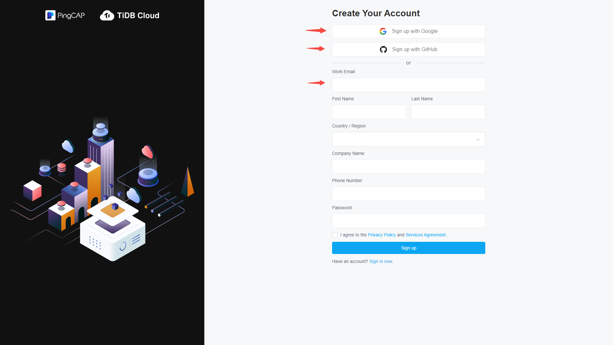
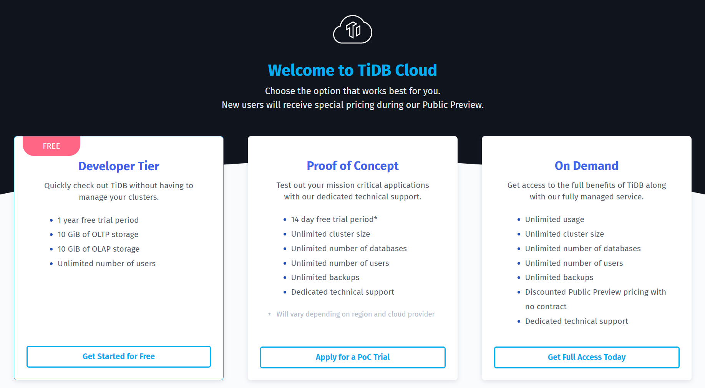
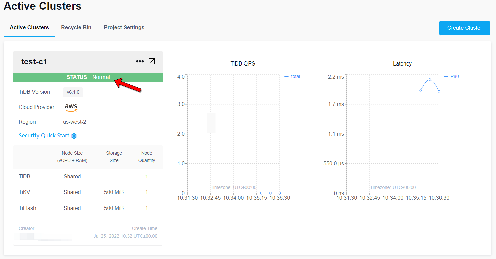

# Exercise 201.1.1a: Register and Use TiDB Cloud Developer Tier as a Practice Environment

## Prerequisites
+ Internet connection.
+ One of pre-installed database clients `mycli`, `mysql`, or `MySQL Workbench`:
  + [mycli](https://www.mycli.net/)
  + [mysql client](https://cn.bing.com/search?q=MacOS+mysql+client+%E5%AE%89%E8%A3%85)
  + [MySQL Workbench - Note Select version: 6.3.10, the page defaults to the latest version](https://downloads.mysql.com/archives/workbench/)

1. Open a browser, visit `https://tidbcloud.com`, click `Sign up` to complete registration and log in.


2. Select Free Developer Tier: Click `Create Cluster` and then select `Developer Tier`.


3. To create a test cluster: Name the Cluster, set a password, select a cloud provider, select a region, click `Create` below, observe the creation steps, and wait about 5-15 minutes until `Status` Changed from `Creating` to `Normal`.


4. Click `Connect` on the right, select `Web SQL Shell`, and then click `>_ Open SQL Shell`.


5. Enter the password set in step 3 to log in, view the database version, and keep the session.


6. Click `Connect` on the TiDB Cloud Cluster page. In the Connect setting window, click one of the buttons to add some rules, then set the `IP Address` and `Description(Optional)`, and then click `Update Filter` to confirm the changes.
Copy the command listed under `Step 2: Connect with a SQL client` and execute (verify that it <tidb_cloud_server_dns_name>has been replaced with the actual DNS name).
  ```
  mysql --connect-timeout 15 -uroot -h <tidb_cloud_server_dns_name> -P 4000 -p
  ```
Alternatively, you can use `mycli`:
  ```
  mycli mysql://root@<tidb_cloud_server_dns_name>:4000
  ```

7. Get the connection id, database version, and current time.
```sql
select connection_id(), tidb_version(), now();
```

8. Log out of the database session (if necessary).
```
exit
```