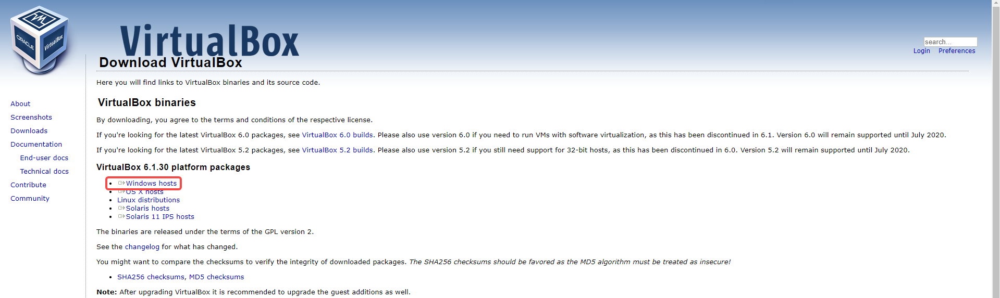
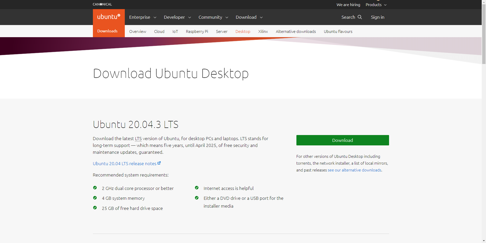
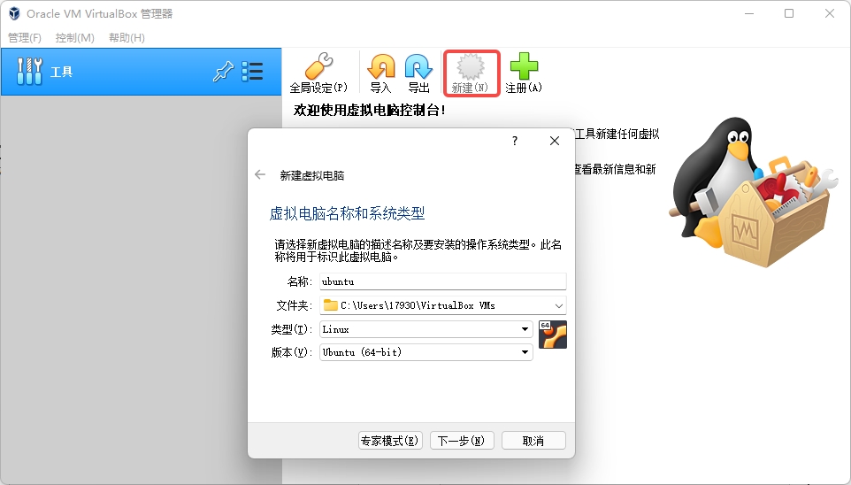
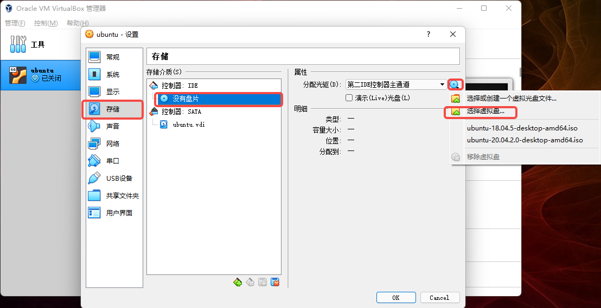
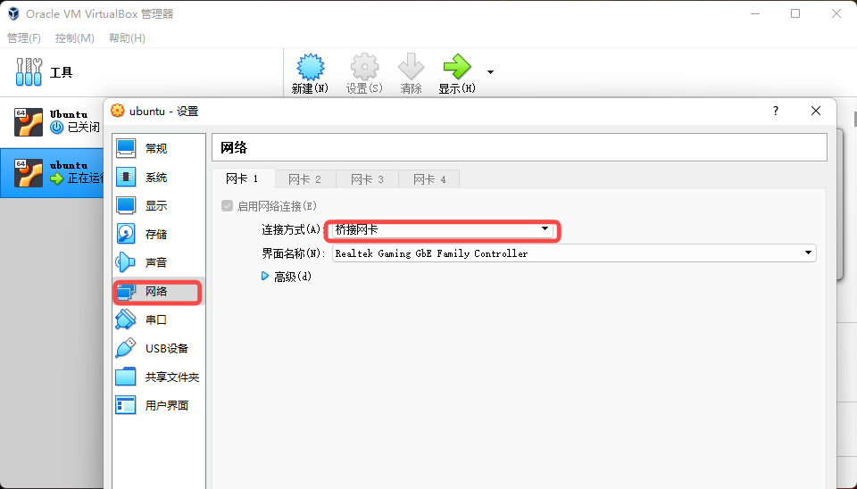
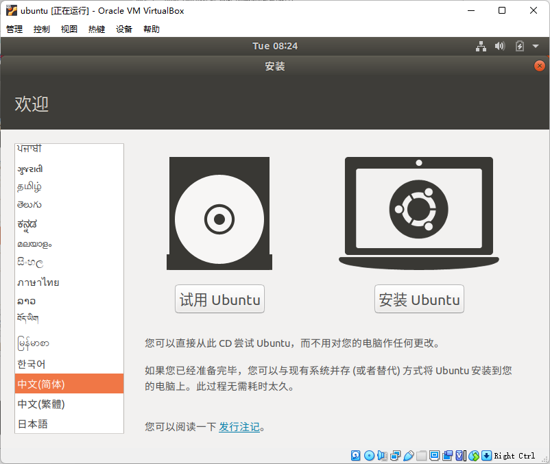
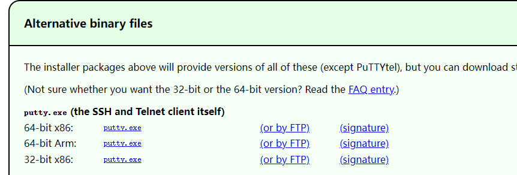
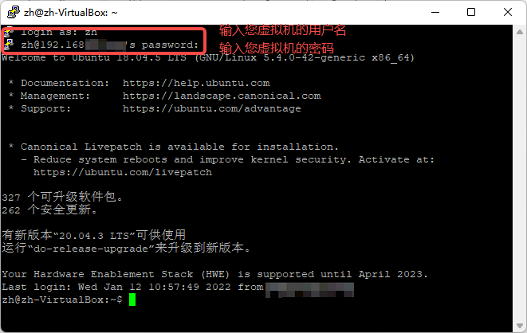

# **实验 201.1.1c: 在单机 `Windows` 中启动虚拟机 `(Ubuntu)`, 并从中启动 `TiDB Playground`**

## **目的**
部署测试目的 TiDB 集群，作为本课程的实验基础

## **适用场景**
+ Windows 系统以及机器自身配置可以创建虚拟机（`Ubuntu`），并且可以部署测试目的 TiDB 集群
+ 具备互联网连接

## **步骤**

****************************
#### 1. 下载 VirtualBox: 打开浏览器，访问 `https://www.virtualbox.org/wiki/Downloads` 选择 Windows 版下载并安装


****************************
#### 2. 下载 Ubuntu 虚拟光盘文件：打开浏览器，访问 `https://ubuntu.com/download/desktop` 选择一个版本下载（本实验以18.04版本为例)


****************************
#### 3. 在 VirtualBox 中创建虚拟机：在 VirtualBox 界面中点击 “新建” ，根据安装指引完成完成安装（可以根据您的机器适当的增加虚拟机硬盘空间，内存等配置）


****************************
#### 4. 在新建的虚拟机中安装 Ubuntu:#
##### 4.1 在“设置”选项中依次点击“存储—没有盘片—光盘图标—选择虚拟盘:”


##### 4.2 在“设置”选项中点击“网络”，连接方式选择“桥接网卡:”


##### 4.3 启动刚刚完成安装设置的虚拟机，根据安装指引完成 Ubuntu 的安装:


****************************
#### 5. 设置 Ubuntu 完成与 Windows 远程连接:
##### 5.1 安装网络组件
```
$ sudo apt install net-tools
```
##### 5.2 查询虚拟机 IP 地址(`inet 192.16x.x.x` 为您的虚拟机 IP 地址)
```
$ ifconfig
```
##### 5.3 连接您的主机(此处输入您的 Windows 主机IP)
```
$ ping 192.16x.x.x
```
##### 5.4 在 Windows 主机的命令行中连接您的虚拟机（此处输入您的 Ubuntu 虚拟机 IP）
```
$ ping 192.16x.x.x
```

****************************
#### 6. 下载 PuTTY  用以之后更加方便的连接到虚拟机: 打开浏览器，访问 `https://www.chiark.greenend.org.uk/~sgtatham/putty/latest.html`


****************************
#### 7. 设置 PuTTY 连接到您的虚拟机



****************************
#### 8. 下载并安装 TiUP 工具:
```
$ curl --proto '=https' --tlsv1.2 -sSf https://tiup-mirrors.pingcap.com/install.sh | sh
```

****************************
#### 9. 声明全局环境变量: 
```
$ source ~/.bashrc
```

****************************
#### 10. 启动集群 (指定版本以及各个组件的实例数量):
```
$ tiup playground --tag classroom --db 2 --pd 3 --kv 3 --tiflash 1
```

****************************
## 输出样例

****************************
#### 步骤10输出参考:
```
$ tiup playground --tag classroom --db 2 --pd 3 --kv 3 --tiflash 1
Starting component `playground`: ~/.tiup/components/playground/v1.8.2/tiup-playground v5.3.0 --tag classroom --db 2 --pd 3 --kv 3 --tiflash 1
Playground Bootstrapping...
Start pd instance
Start pd instance
Start pd instance
Start tikv instance
Start tikv instance
Start tikv instance
Start tidb instance
Start tidb instance
Waiting for tidb instances ready
127.0.0.1:4000 ... Done
127.0.0.1:4001 ... Done
Start tiflash instance
Waiting for tiflash instances ready
127.0.0.1:3930 ... Done
CLUSTER START SUCCESSFULLY, Enjoy it ^-^
To connect TiDB: mysql --comments --host 127.0.0.1 --port 4001 -u root -p (no password)
To connect TiDB: mysql --comments --host 127.0.0.1 --port 4000 -u root -p (no password)
To view the dashboard: http://127.0.0.1:2379/dashboard
PD client endpoints: [127.0.0.1:2379 127.0.0.1:2382 127.0.0.1:2384]
To view the Prometheus: http://127.0.0.1:9090
To view the Grafana: http://127.0.0.1:3000
```