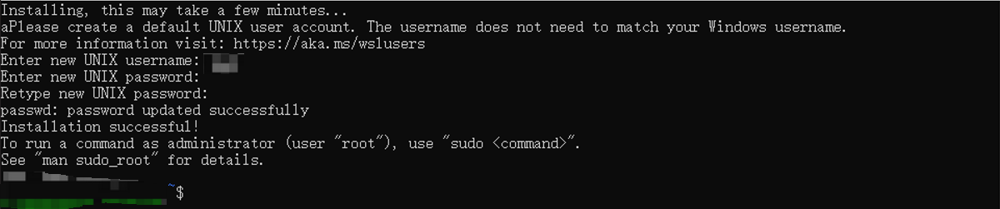

# **实验 1e: 在单机 `Windows` 中安装 `WSL` `(Ubuntu)`, 并从中启动 `TiDB Playground`**

## **目的**
部署测试目的 TiDB 集群，作为本课程的实验基础

## **适用场景**
+ Windows 系统版本需要 2004 及更高版本（内部版本 19041 及更高版本）或 Windows 11，并且可以部署测试目的 TiDB 集群
+ 具备互联网连接

## **步骤**

****************************
#### 1. 打开管理员 PowerShell 或 Windows 命令提示符安装 WSL :
```
> wsl --install
```

****************************
#### 2. 安装完成后重启计算机，开机后会自动进入 Ubuntu 命令行,设置您的 Ubuntu 用户 :


****************************
#### 3. 下载并安装 mysql-client:
```
$ apt install mysql-client-core-8.0
```

****************************
#### 4. 下载并安装 TiUP 工具:
```
$ curl --proto '=https' --tlsv1.2 -sSf https://tiup-mirrors.pingcap.com/install.sh | sh
```

****************************
#### 5. 声明全局环境变量: 
```
$ source ~/.bashrc
```

****************************
#### 6. 启动集群 (指定版本以及各个组件的实例数量):
```
$ tiup playground --tag classroom --db 2 --pd 3 --kv 3 --tiflash 1
```

****************************
## 输出样例

****************************
#### 步骤 6 输出参考:
```
$ tiup playground --tag classroom --db 2 --pd 3 --kv 3 --tiflash 1
tiup is checking updates for component playground ...
A new version of playground is available:
   The latest version:         v1.9.0
   Local installed version:
   Update current component:   tiup update playground
   Update all components:      tiup update --all

The component `playground` version  is not installed; downloading from repository.
download https://tiup-mirrors.pingcap.com/playground-v1.9.0-linux-amd64.tar.gz 6.91 MiB / 6.91 MiB 100.00% 13.10 MiB/s
Starting component `playground`: /root/.tiup/components/playground/v1.9.0/tiup-playground /root/.tiup/components/playground/v1.9.0/tiup-playground --tag classroom --db 2 --pd 3 --kv 3 --tiflash 1
Playground Bootstrapping...
Start pd instance:v5.3.0
The component `pd` version v5.3.0 is not installed; downloading from repository.
download https://tiup-mirrors.pingcap.com/pd-v5.3.0-linux-amd64.tar.gz 41.25 MiB / 41.25 MiB 100.00% 9.90 MiB/s
Start pd instance:v5.3.0
Start pd instance:v5.3.0
Start tikv instance:v5.3.0
The component `tikv` version v5.3.0 is not installed; downloading from repository.
download https://tiup-mirrors.pingcap.com/tikv-v5.3.0-linux-amd64.tar.gz 167.92 MiB / 167.92 MiB 100.00% 9.45 MiB/s
Start tikv instance:v5.3.0
Start tikv instance:v5.3.0
Start tidb instance:v5.3.0
The component `tidb` version v5.3.0 is not installed; downloading from repository.
download https://tiup-mirrors.pingcap.com/tidb-v5.3.0-linux-amd64.tar.gz 47.67 MiB / 47.67 MiB 100.00% 6.65 MiB/s
Start tidb instance:v5.3.0
Waiting for tidb instances ready
127.0.0.1:4000 ... Done
127.0.0.1:4001 ... Done
The component `prometheus` version v5.3.0 is not installed; downloading from repository.
download https://tiup-mirrors.pingcap.com/prometheus-v5.3.0-linux-amd64.tar.gz 87.08 MiB / 87.08 MiB 100.00% 9.66 MiB/s
download https://tiup-mirrors.pingcap.com/grafana-v5.3.0-linux-amd64.tar.gz 50.00 MiB / 50.00 MiB 100.00% 9.20 MiB/s
Start tiflash instance:v5.3.0
The component `tiflash` version v5.3.0 is not installed; downloading from repository.
download https://tiup-mirrors.pingcap.com/tiflash-v5.3.0-linux-amd64.tar.gz 412.72 MiB / 412.72 MiB 100.00% 8.27 MiB/s
Waiting for tiflash instances ready
127.0.0.1:3930 ... Done
CLUSTER START SUCCESSFULLY, Enjoy it ^-^
To connect TiDB: mysql --comments --host 127.0.0.1 --port 4001 -u root -p (no password)
To connect TiDB: mysql --comments --host 127.0.0.1 --port 4000 -u root -p (no password)
To view the dashboard: http://127.0.0.1:2379/dashboard
PD client endpoints: [127.0.0.1:2379 127.0.0.1:2382 127.0.0.1:2384]
To view the Prometheus: http://127.0.0.1:9090
To view the Grafana: http://127.0.0.1:3000
```