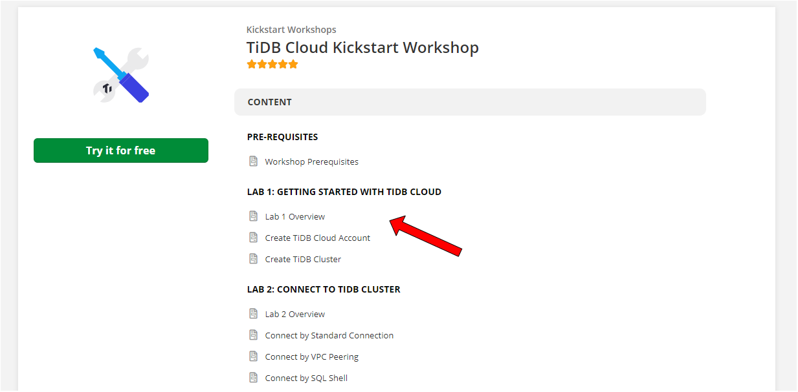
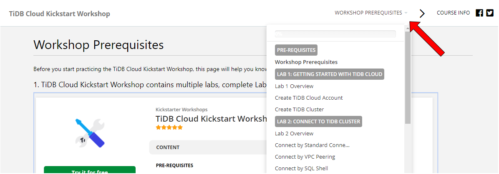
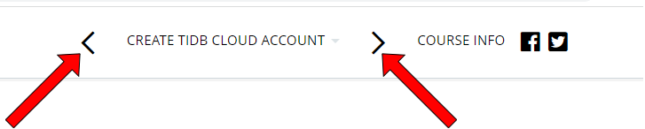
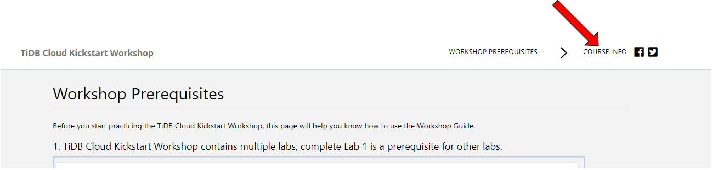
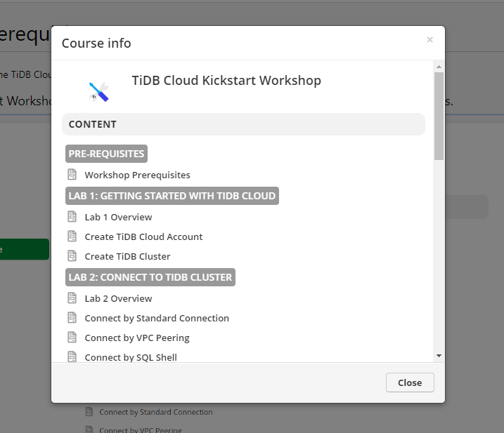
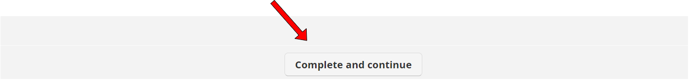

# Workshop Guide

1. Developer Bootcamp Workshop contains multiple labs, complete Lab 1 is a prerequisite for other labs.

2. You can click the task name on the upper-right menu bar to open the Lab and Task navigator.

3. The `<` and `>` symbols are the `Previous Task` and `Next Task` buttons.

4. You can click the `COURSE INFO` on the upper-right menu bar to open the workshop outline.

5. The button at the end can mark task completion and move forward to the next task.

