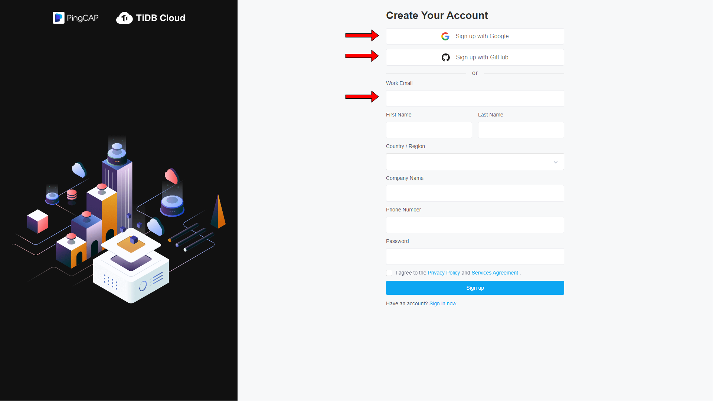

# Create TiDB Cloud Account

1. Go to [https://tidbcloud.com](https://tidbcloud.com) and sign up TiDB Cloud account (Skip this step if you already have a TiDB Cloud account). Click `Sign up` to register a TiDB Cloud account. You can sign up with Google, GitHub, Work Email or [AWS Marketplace](https://aws.amazon.com/marketplace).

2. Go to [https://tidbcloud.com](https://tidbcloud.com) and `Sign in` with your TiDB Cloud account.

