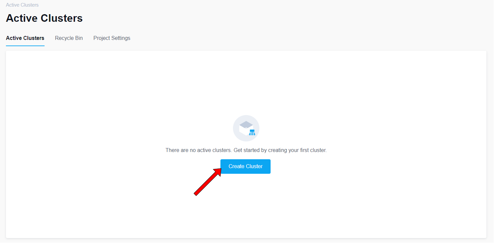
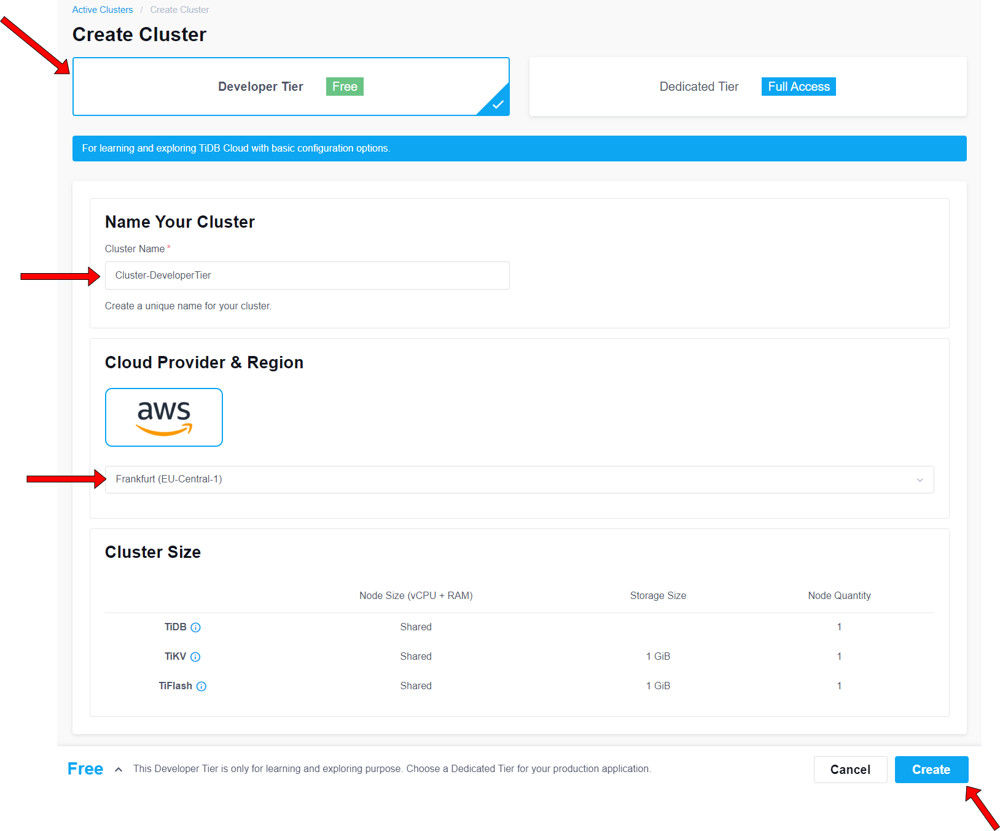
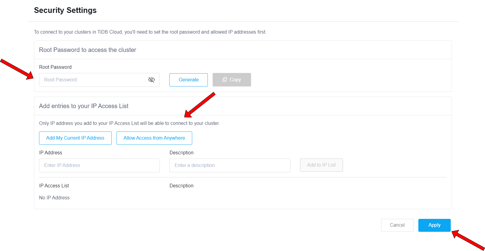
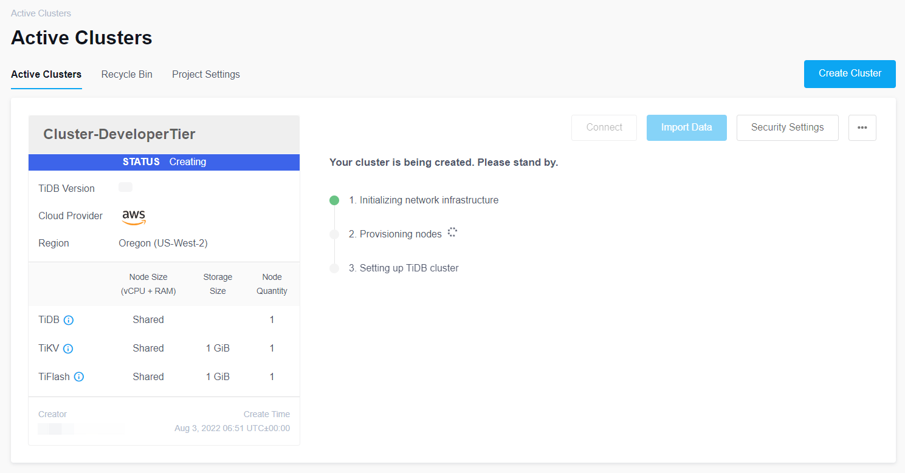
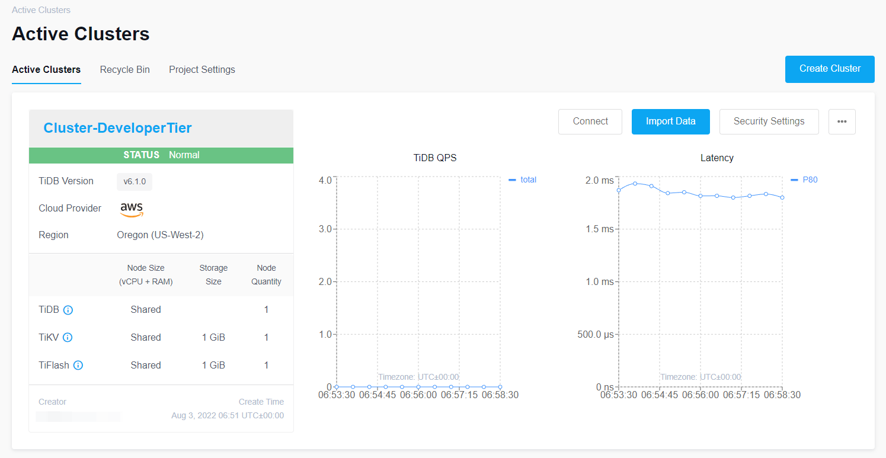

# Create a Developer Tier Cluster

1. On the `Active Clusters` page, click `Create Cluster`.


2. On the Create Cluster page, select `Developer Tier` and set the `Cluster Name`, choose a Cloud provider `Region` and then click `Create`.
Note that the Developer Tier clusters cannot modify `Cloud Provider`, `Node Size`, `Storage Size` and `Node Quantity`.
  

3. In the Security Settings window, set the `Root Password to access the cluster` and `Add entries to your IP Access List`, and then click `Apply`.


4. Wait for your TiDB Cloud cluster to be created. (approximately 10 to 30 minutes)



5. In the Active Clusters tab, click `Connect`.


6. In the Connect setting window, click one of the buttons to add some rules, set the `IP Address` and `Description(Optional)`, and then click `Update Filter` to confirm the changes. If the traffic filter is already set, you can edit it or skip this step.               


7. Note down the value of hostname, username and port number, as you will use them later. 


8. Set environment variables for connecting to TiDB Cloud cluster you created in previous steps:
```
$ export TIDB_CLOUD_HOST=<TiDB Cloud cluster hostname>
$ export TIDB_CLOUD_USERNAME=<database username>
$ export TIDB_CLOUD_PASSWORD=<user password>
$ export TIDB_CLOUD_PORT=<port number>
```
